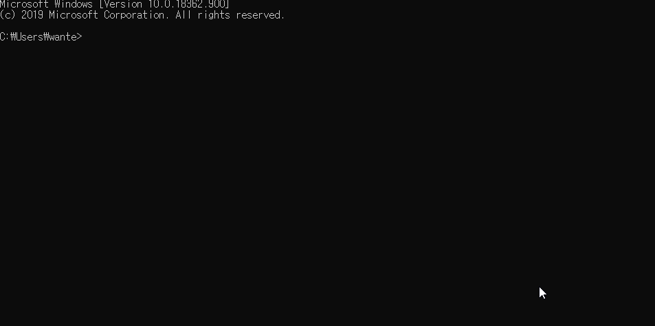
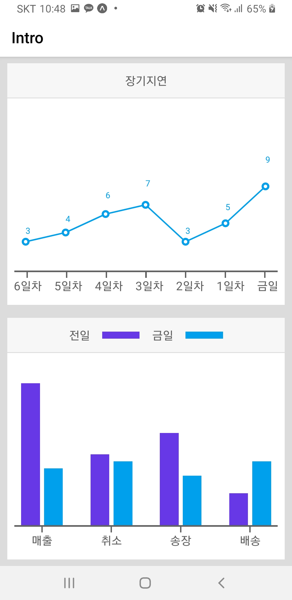
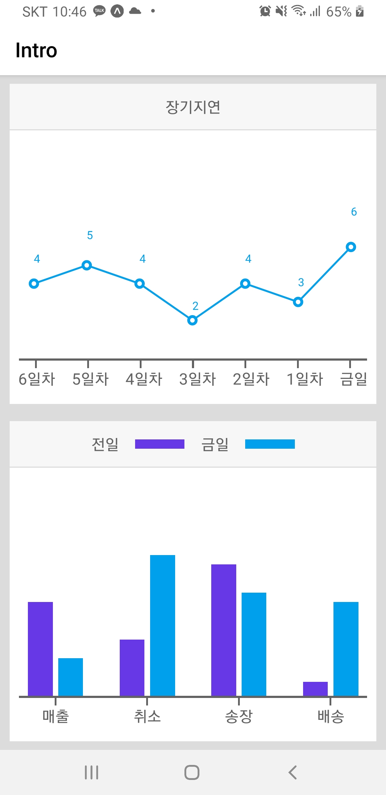
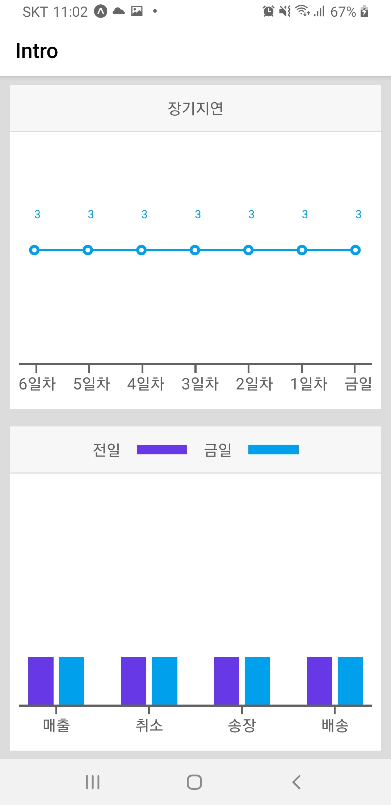
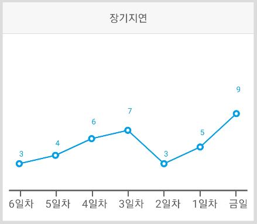
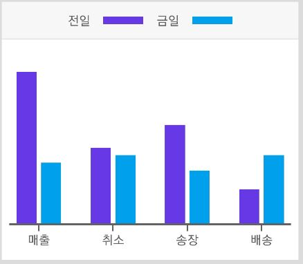

# dooboolab
>블로그 : <https://jroomstudio.tistory.com/>    
>Email : <jhhh171224@gmail.com>   
>dooboo-cli : <https://github.com/dooboolab/dooboo-cli>   
>web-expo : <https://docs.expo.io/>   
>dooboo-cli를 이용하여 expo 프로젝트 생성하여 expo web으로 개발    
></img>
* * *
### 화면 
  > #### 완성
  > </img>
  > </img>
  > </img>   
  > 메인화면 소스코드 
  > <https://github.com/ll0301/dooboolabTestApp/blob/master/TestApp/src/components/screen/Intro.tsx>    
* * *
  > #### 1번 그래프
  > </img>    
  > 1번 그래프 소스코드 
  > <https://github.com/ll0301/dooboolabTestApp/blob/master/TestApp/src/components/shared/ChartEx1.tsx>    
* * *
  > #### 2번 그래프
  > </img>    
  > 2번 그래프 소스코드   
  > <https://github.com/ll0301/dooboolabTestApp/blob/master/TestApp/src/components/shared/ChartEx2.tsx>   
* * *
